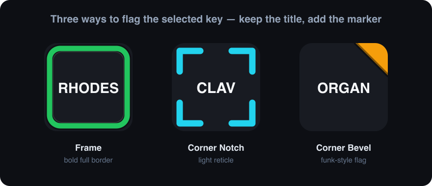

# Radio Button Selection Frames

Coloured **selection frames** and **corner notches** for Stream Deck — a
visual "this key is the active one" marker for radio-button groups.

Stream Deck lets you put a text **title** on a key, but it has no built-in way
to say *"this option is currently selected"*. This pack fills that gap: keep a
plain text title on the key, then set one of these icons as the key's
**selected / pressed** state image. The title now sits inside a bright coloured
frame (or four corner notches) so the chosen option stands out at a glance —
even under stage lighting.

The centre stays fully transparent, so the white title text keeps maximum
contrast on every colour and the icon composites cleanly over the key's own
background.



## Three styles × 19 colours = 76 icons

- **Selected Frame** — a bold rounded border hugging the key edge. Loudest
  signal; best when the whole panel is one radio group.
- **Selected Corner Notch** — four L-shaped corner brackets, centre clear.
  Subtler; a light reticle around the title.
- **Selected Corner Bevel (Left / Right)** — a single chamfered top corner
  (a coloured "dog-ear") with a dark liseré on the diagonal — the exact trick
  the funk instrument icons used to flag a key. Left and right variants so two
  groups can share one panel (e.g. one group blue on the left, another yellow
  on the right, like the funk comping/impro split).

Colours: white, slate, red, orange, amber, yellow, lime, green, emerald, teal,
cyan, sky, blue, indigo, violet, purple, fuchsia, pink, rose.

## How to use it as a radio button

These are the **state 1 (selected)** image. State 0 (idle) = no frame, just the
plain title. Drive the swap with a multi-state MIDI action bound to an
**exclusive group** so pressing one key clears the frame on all the others.

With the Trevligaspel *MIDI* plugin (or any plugin exposing the same state
script), the radio logic is three lines — `@radio:1` is the exclusive group id
shared by every key in the group:

```text
[(@radio:1){state:0}]          # another key in group "radio:1" was pressed → go idle (no frame)
[(release){state:1}]           # on release stay selected (keep the frame)
[(press){state:1}{@radio:1}]   # on press → selected (show frame) AND claim group radio:1 (clears the others)
```

Give each key the same `@radio:1` group; only one key holds state 1 (its frame
shown) at a time. Use a different group id (`@radio:2`, …) per independent set
of keys. Add a `{cc:CH,CC,VAL}` to the `press` line if the key should also send
MIDI when it becomes the selected one.

## Install

Double-click `dist/com.beennnn.radioframes.streamDeckIconPack` — Stream Deck
installs it into the icon library, then pick a frame from the key's icon
picker. Or upload it to the Elgato Maker Console (maker.elgato.com).

## Build from source

```sh
python3 gen_frames.py           # regenerate src/*.svg + tags.json (edit COLOURS/geometry first)
bin/build.sh                    # render → validate → contact sheet → package
```

Built with the [sdicons](https://github.com/Beennnn/stream-deck-icons) toolkit
(`../stream-deck-icons`, or set `$SDICONS`). Requires `rsvg-convert`
(`brew install librsvg`) + Pillow.

## License

Icons CC-BY-4.0 — see [license.txt](license.txt). Generator/tooling MIT.
